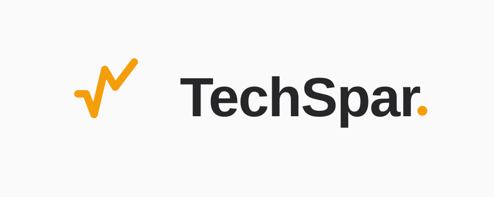

<div align="center">



**把专项训练、简历面试、JD 备面、实时 Copilot 与录音复盘，串成一个持续进化的技术面试闭环。**

[在线 Demo](https://techspar.top/) · [快速开始](#快速开始) · [English](README.en.md)

[](https://bun.sh/)
[](https://hono.dev/)
[](https://react.dev/)
[](https://www.docker.com/)
[](LICENSE)


</div>

TechSpar 不只是生成一组面试题。专项训练、简历面试、JD 备面、实时 Copilot 和录音复盘共用同一套长期画像、知识库、薄弱点和复习调度；每轮结果会写回系统，改变下一轮训练重点。

## 版本与分支

- **`main`**：当前版本。后端已完全迁移为 TypeScript + Bun + Hono，使用 Bun workspace 统一管理前后端依赖；新功能和修复都在这里继续。
- **`legacy/python-backend`**：迁移前最后一个 Python + FastAPI 版本，固定在提交 `73d1a7c`，只作为历史归档和紧急回看，不再接收新功能。

两个分支不会同时写同一份数据。需要查看旧版时使用独立目录和数据副本：

```bash
git switch legacy/python-backend
```

切回新版：

```bash
git switch main
```

## 功能闭环

- **专项强化训练**：结合题库、知识库、历史薄弱点和掌握度动态出题。
- **简历模拟面试**：读取简历并按自我介绍、技术问题、项目深挖、反问环节推进。
- **JD 定向备面**：拆解岗位描述，结合简历与历史画像生成岗位相关策略和问题。
- **实时 Copilot**：实时 ASR、追问方向预测、回答建议、风险提示，以及可选声纹角色识别。
- **录音复盘**：转写长短录音，结构化 Q&A，输出逐题分析与改进建议。
- **长期画像**：汇总强项、薄弱点、训练轨迹，并通过 SM-2 安排复习。
- **个人资料库**：导入 PDF、DOCX、Markdown 和文本，为训练与个人 Agent 提供上下文。
- **数据迁移**：导出/导入单账户或管理员全站归档；个人敏感凭证默认不导出。

## 快速开始

### 环境要求

- Bun `1.3.14` 或兼容的 `1.3.x`
- macOS、Linux 或 Windows

### 本地开发

```bash
git clone https://github.com/AnnaSuSu/TechSpar.git
cd TechSpar
bun install --frozen-lockfile
cp .env.example .env
```

终端一启动 API：

```bash
bun run dev:api
```

终端二启动 Web：

```bash
bun run dev:web
```

访问 <http://localhost:5173>。默认登录信息：

```text
admin@techspar.local
admin123
```

部署时必须在 `.env` 中修改 `JWT_SECRET` 和默认密码。

### Docker

```bash
docker compose up --build
```

启动后访问 <http://localhost>。

## 模型与服务配置

LLM、Embedding、DashScope、Tavily、OSS 与腾讯云 VPR 密钥默认按用户隔离保存在本地数据目录，登录后在“设置”中填写；`.env` 只放启动配置和可选的平台兜底模型。

- **LLM**：任意 OpenAI-compatible API。
- **Embedding API**：任意 OpenAI-compatible embeddings 接口；完整的 `/v1/embeddings` 地址会自动归一化。
- **本地 Embedding**：使用 Transformers.js + ONNX，默认 `Xenova/bge-m3`；首次运行自动下载并缓存，不需要 Python、PyTorch 或 pip。
- **DashScope**：语音输入、录音转写和 Copilot 实时 ASR。
- **Tavily**：Copilot 公司信息搜索。
- **阿里云 OSS**：长录音异步转写的临时对象存储。
- **腾讯云 VPR**：可选的 HR/候选人声纹区分。

## 技术架构

| 层 | 技术 |
| --- | --- |
| API Host | Bun 1.3、Hono 4、`@hono/zod-openapi` |
| Core | 纯 TypeScript 用例、状态机和端口 |
| Storage | SQLite、原子 JSON/文件存储 |
| Providers | OpenAI-compatible、Transformers.js、DashScope、OSS、Tavily、腾讯云 VPR |
| Web | React 19、React Router 7、Vite 8、Tailwind CSS 4 |
| Contracts | Zod、OpenAPI 3.1、生成的前端类型 |
| Test | Bun Test、OpenAPI 契约对照、Node 兼容性检查 |

项目采用模块化单体和六边形边界：Hono 只负责 HTTP/SSE/WebSocket 映射，业务规则在 `packages/core`，数据库、文件和供应商实现位于外层适配器。详见 [TypeScript 后端架构](docs/typescript-backend-architecture.md)。

```text
apps/api/             Bun + Hono 组合入口与路由
packages/contracts/   OpenAPI 与传输协议
packages/core/        业务用例、状态机、端口
packages/db/          SQLite repositories
packages/platform/    文件、认证、配置与归档适配器
packages/providers/   LLM、Embedding、ASR、OSS、搜索与声纹适配器
frontend/             React Web 客户端
tests-ts/             TypeScript 测试与旧版 OpenAPI 基线
```

## 质量检查

```bash
bun run check
```

该命令依次执行 Bun/Node 类型检查、架构边界检查、后端与前端测试、API 和 Web 构建。OpenAPI 文件和前端类型可通过以下命令重新生成：

```bash
bun run gen:api
```

## 数据与备份

默认数据位于 `data/`：SQLite 保存会话和任务状态，用户文件位于 `data/users/{user_id}/`。在“设置 → 数据迁移”中可以：

- 导出当前账户的可移植备份；敏感凭证需要显式选择才会包含；
- 将个人备份导入另一个账户，数据会安全重绑定到当前用户；
- 管理员导出完整系统备份。

归档会验证路径、链接、tar 校验和与解压上限；向量索引作为派生数据在导入后重建。

## 参与贡献

欢迎提交 [Issue](https://github.com/AnnaSuSu/TechSpar/issues) 或 PR。开发约定和流程见 [CONTRIBUTING.md](CONTRIBUTING.md)。

## License

CC BY-NC 4.0。

例外：`frontend/src/resume/` 的简历编辑与模板代码移植自 [Magic Resume](https://github.com/JOYCEQL/magic-resume)，保留该目录内的原始协议与附加条款。

## 致谢

感谢 [LINUX DO](https://linux.do/) 社区，以及 Magic Resume 原作者 [@JOYCEQL](https://github.com/JOYCEQL)。
